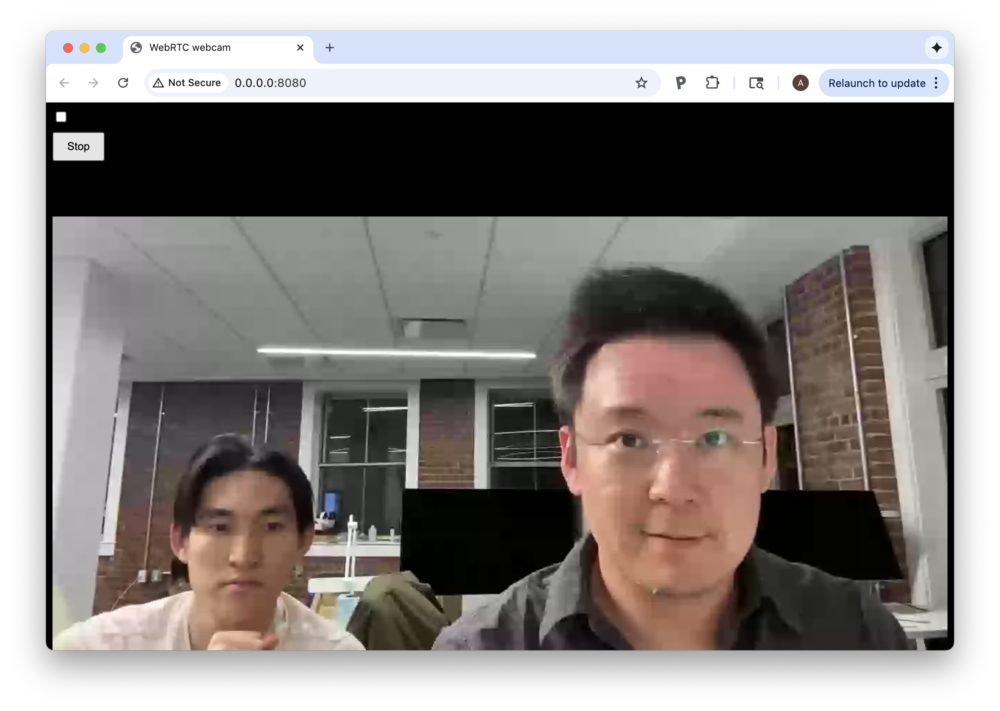
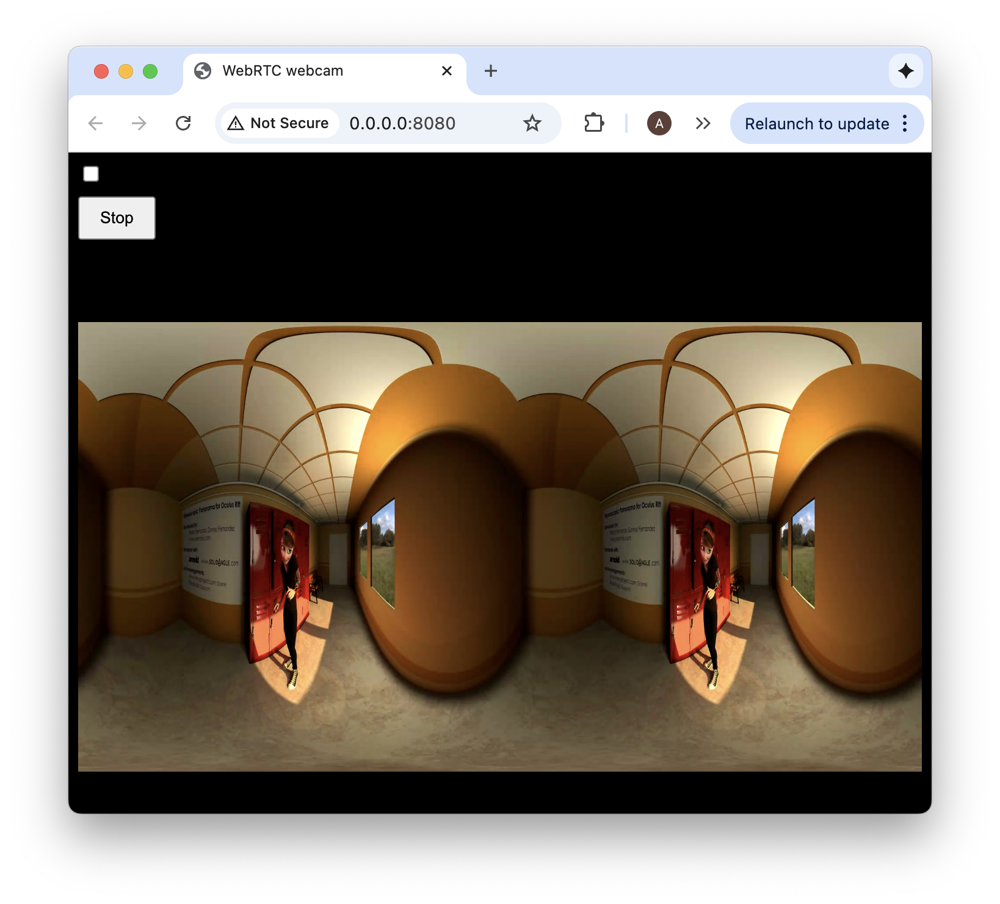

# `vuer` WebRTC Teleop Example

This repo contains examples to use vuer to teleoperate a bimanual robot, where the stereo video feed is sent back to the
Quest3 and Apple Vision Pro via webRTC.

Let's focus on the [./vuer_teleop_demo/webrtc_video_panels](./vuer_teleop_demo/webrtc_video_panels) example.
The code is organized as follows:

```
> webrtc_video_panels/
  > index.html          # Example html file with the webRTC javascript client, 
                        # used to verify that your webRTC server is working.
                        
  > rtc_server.py       # WebRTC signaling server that streams video from the camera
                        # You will want to run this on your robot that has the cameras connected,
                        # which will stream the video feed to the vuer client.
                        # 
                        # This is also why be sure to setup the SSL certificates, as immersive experience
                        # in webXR requires secure connections (https and wss as opposed to http and ws://).
                        # for this, the easiest way is to use ngrok or localtunnel to create a secure tunnel.
                        
  > video_panel.py      # vuer Video Panel class that displays the video feed in VR
```

This example uses the `uv` package manager. First, install the dependencies:

```shell
uv sync --all-extras
```

Step 1 Verify the WebRTC Video Server

We have a modified WebRTC script that transmits video
from your macbook's main camera. This example is located
at [./webrtc]

```shell
uv run python ./src/vuer_teleop_demo/webrtc_video_panels/rtc_server.py --verbose
```

outputs

```log
Set up the environment variable VUER_DEV_URI. This needs to be a public IP.
to connect from webXR, you need to have STL/SSL enabled. Follow the instruction here:
link: https://letsencrypt.org/getting-started/
now connect to: https://0.0.0.0:8080
Arguments:
{   'audio_codec': None,
    'cert_file': None,
    'cors': 'https://vuer.ai',
    'description': 'WebRTC webcam demo',
    'device': None,
    'format': None,
    'host': '0.0.0.0',
    'key_file': None,
    'play_from': None,
    'play_without_decoding': None,
    'port': 8080,
    'verbose': True,
    'video_codec': None}
======== Running on http://0.0.0.0:8080 ========
(Press CTRL+C to quit)
```

This shows that the rtc server is running. Now, you can verify that the camera video feed is working, by opening up the
WebRTC example html file
at [./vuer_teleop_demo/webrtc_video_panels/index.html](./vuer_teleop_demo/webrtc_video_panels/index.html) It should look
like this:



You can also pass in a video file to stream instead of the camera feed. We provide the Occulus Mary demo
video [MaryOculus.mp4](./vuer_teleop_demo/webrtc_video_panels/MaryOculus.mp4) for testing:

```shell
uv run python ./src/vuer_teleop_demo/webrtc_video_panels/rtc_server.py --play ./src/vuer_teleop_demo/webrtc_video_panels/MaryOculus.mp4
```

It should look like this:




Step 2 Setting Up Secure Connection with SSL Certificates

On your mac or the workstation/robot that is running the rtc_server.py, you need to setup SSL certificates, 
because for the VR device running the immersive experience, this rtc server is not localhost. So the localhost
exemptions do not apply. 

We will do a simple self-certified SSL certificate for testing purposes. 

```shell
cd ./src/vuer_teleop_demo/webrtc_video_panels/
mkdir .certs && cd .certs
openssl req -x509 -nodes -days 365 -newkey rsa:2048 \
  -keyout local.key -out local.crt \
  -subj "/CN=192.168.2.12"
```

You should now have `local.crt` and `local.key` files in the `.certs` folder.

Now configure the webRTC server:

```shell
uv run python ./src/vuer_teleop_demo/webrtc_video_panels/rtc_server.py \
  --host 192.168.2.12 \
  --cert-file ./src/vuer_teleop_demo/webrtc_video_panels/.certs/local.crt \
  --key-file ./src/vuer_teleop_demo/webrtc_video_panels/.certs/local.key
```

You’ll get a browser warning unless you import the certificate as trusted.
---

older README

- **2D Video**
- **Stereo Video**
- **2D WebRTC**
- **Stereo WebRTC**

Others

- **HUD** (moves with the user's head)
- **Stationary Display** (stays at a fixed location)
- **Movable Display**

## Step 1 Verify the RTC Server

```shell
/home/user/anaconda3/bin/conda run -n vuer --no-capture-output \
  python /home/user/mit/webrtc-teleop-demo/webrtc_video_panels/rtc_server.py \
  --cert-file /etc/letsencrypt/live/$MY_DOMAIN/fullchain.pem \
  --key-file /etc/letsencrypt/live/$MY_DOMAIN/privkey.pem \
  --cors https://$MY_DOMAIN \
  --device=/dev/video2 
```

You should be able to click on the "START" button, and see the camera stream.


To see the list of camera devices, do


and you should select to first row for each device.

```shell
v412-ctl --list-devices
```

gives

```
Global Shutter Camera: Global S (usb-0000:0c :00.0-2) :
 /dev/video4
 /dev/video5
 /dev/media2
Global Shutter Camera: Global S (usb-0000:0c: 00.0-3) :
 /dev/video2
 /dev/video3
 /dev/media1
Global Shutter Camera: Global S (usb-0000:0c:00.0-5.2) :
 /dev/video0
 /dev/video1 /dev/mediao
```

